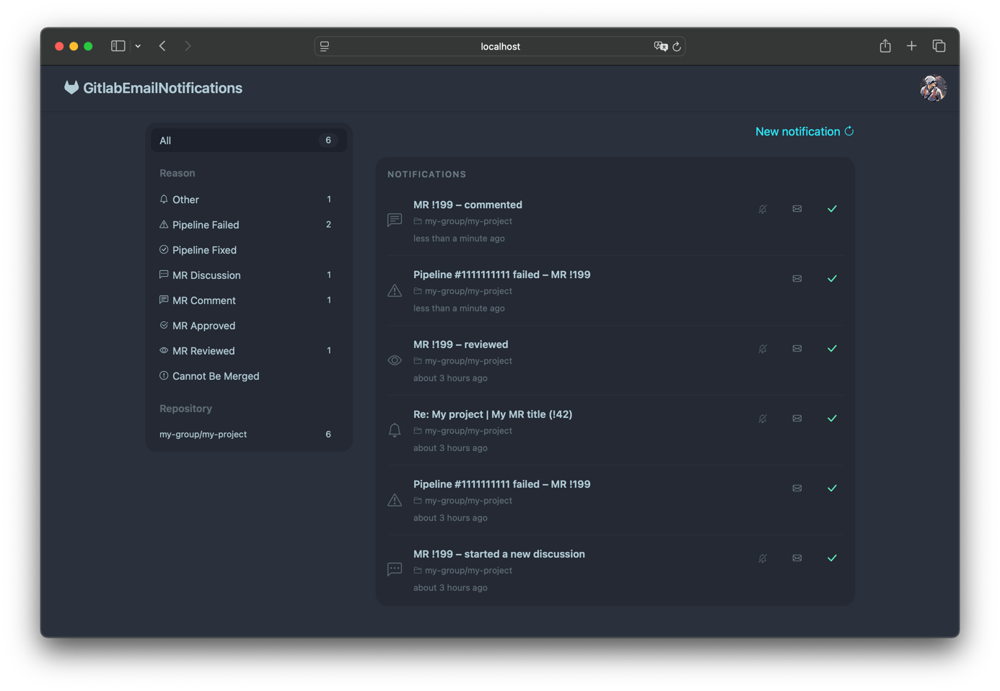
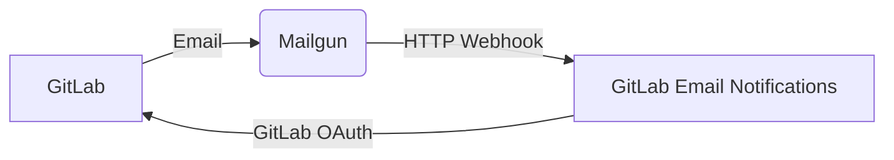

# GitLab Email Notifications

The missing **notification center** that [GitLab doesn't have](https://gitlab.com/gitlab-org/gitlab/-/work_items/14889).



It ingests GitLab notification emails via Mailgun and presents them in a unified, filterable inbox.
Authentication is handled via GitLab OAuth.




## Quick start with Docker Compose

See [docker-compose.yml](docker-compose.yml) for a ready-to-use configuration.
Just fill in the environment variables.

## Environment variables

All configuration is done via environment variables. 
Set them in `.env` for local development, or pass them directly in `docker-compose.yml`
/ your hosting platform for production.

| Variable | Required | Description                                                                                                               |
|---|---|---------------------------------------------------------------------------------------------------------------------------|
| `SECRET_KEY_BASE` | Yes | Random secret for cookies and encrypted tokens. Generate with `bin/rails secret` <br> or any 128-character random string. |
| `GITLAB__APP_ID` | Yes | OAuth Application ID from GitLab.                                                                                         |
| `GITLAB__APP_SECRET` | Yes | OAuth Application Secret from GitLab.                                                                                     |
| `GITLAB__CALLBACK_URL` | Yes | Full URL to `https://example.com/oauth/gitlab/callback` on your domain.                                                   |
| `EMAIL_DOMAIN` | Yes | The custom domain configured in Mailgun (e.g. `gitlab.example.com`).                                                      |
| `MAILGUN_INGRESS_SIGNING_KEY` | Yes | HTTP webhook signing key from Mailgun API Security. Read automatically by Action Mailbox.                                 |
| `ADMIN__USERNAME` | Yes | Username for the admin panel (HTTP Basic Auth).                                                                           |
| `ADMIN__PASSWORD` | Yes | Password for the admin panel (HTTP Basic Auth).                                                                           |

## GitLab OAuth Application

1. Go to <https://gitlab.com/-/profile/applications> and create a new application:
   - **Name:** GitLab Email Notifications
   - **Redirect URI:** `https://your-domain.example.com/oauth/gitlab/callback`
   - **Scopes:** `read_user`
2. Copy the **Application ID** → `GITLAB__APP_ID`
3. Copy the **Secret** → `GITLAB__APP_SECRET`
4. Set `GITLAB__CALLBACK_URL` to the same redirect URI you entered above.

## Mailgun setup

1. Add a custom domain in Mailgun (e.g. `gitlab.example.com`).
2. Add the DNS records Mailgun provides and verify the domain.
3. Create a **Route**:
   - **Match recipient:** `.*@gitlab.example.com`
   - **Action → Forward:** `https://your-domain.example.com/rails/action_mailbox/mailgun/inbound_emails/mime`
4. Go to **API Security** → copy the **HTTP webhook signing key** → `MAILGUN_INGRESS_SIGNING_KEY`.
5. Set `EMAIL_DOMAIN=gitlab.example.com`.

In GitLab, configure your notification emails to go to
`<user-prefix>@gitlab.example.com`. Each user's personal forwarding address is
shown in the onboarding flow after sign-in.

## Admin panel

The following engines are mounted under `/admin/*` and protected by HTTP Basic Auth
(`ADMIN__USERNAME` / `ADMIN__PASSWORD`):

| Path | Description |
|---|---|
| `/admin/errors` | Application errors ([SolidErrors](https://github.com/fractaledmind/solid_errors)) |
| `/admin/apm` | Performance monitoring ([SolidAPM](https://github.com/Bhacaz/solid_apm)) |
| `/admin/jobs` | Background job queue ([SolidQueueDashboard](https://github.com/akodkod/solid-queue-dashboard)) |


## Development setup

**Prerequisites:** Ruby (see `.ruby-version`), Bundler.

```sh
cp .env.example .env
# Fill in .env with your credentials

bundle install
bin/rails db:setup
bin/rails server
```

The dev login shortcut at `GET /dev/login` signs you in as the first user in the
database — no OAuth flow needed for local testing.
